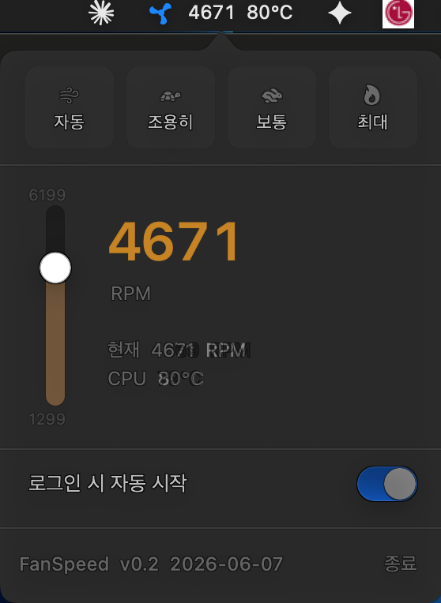

# FanSpeed

macOS 메뉴바 팬 속도 제어 앱. Intel Mac 대상 (MacBook Pro 11,1 검증).

<p align="center">
  
</p>

## 주요 기능

- **메뉴바 라이브 표시** — 현재 RPM과 CPU 온도가 메뉴바에 항상 표시
- **4가지 프리셋** — 자동 / 조용히 / 보통 / 최대
- **수직 슬라이더** — 1 RPM 단위 미세 조절
- **백그라운드 데몬** — 최초 1회 설치 후 비밀번호 없이 즉시 제어
- **로그인 시 자동 시작** — LaunchAgent (관리자 권한 불필요)

## 빌드 / 실행

```bash
bash build.sh
./FanSpeed
```

의존성 없음. 표준 macOS SDK만 사용 (AppKit + IOKit + Foundation). Xcode 불필요 — `swiftc` CLI로 컴파일.

## 권한 흐름

| 동작 | 권한 | 비고 |
|------|------|------|
| 팬 RPM / 온도 읽기 | 일반 사용자 | IOKit 직접 |
| 팬 속도 쓰기 (데몬 설치 후) | root (데몬) | 파일 IPC, 비밀번호 불필요 |
| 데몬 설치 | root (최초 1회) | osascript + launchctl |
| 자동 시작 등록 | 사용자 | LaunchAgent |

최초 실행 시 데몬 설치 안내 다이얼로그가 한 번 뜨고, 이후로는 비밀번호 입력이 필요 없습니다.

## 아키텍처

상세한 SMC 키 매핑, fpe2 포맷, 파일 IPC 구조는 [ARCHITECTURE.md](ARCHITECTURE.md) 참고.

## 만든이

월평동 이상목
