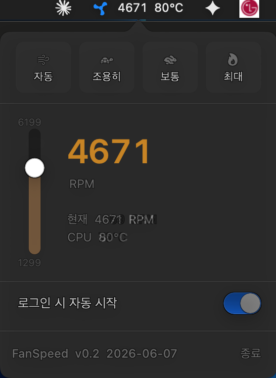

# FanSpeed

macOS 메뉴바 팬 속도 제어 앱. Apple Silicon과 Intel, macOS 11 이상 대상.
Intel MacBook Pro 11,1의 기존 제어 방식과 M5 Pro / macOS 26.5.1의 센서 읽기를 지원한다.

<p align="center">
  
</p>

## 주요 기능

- **메뉴바 라이브 표시** — 팬별 현재 RPM과 CPU 온도를 2초마다 표시
- **모델 선택 스위치** — New 모델(Apple Silicon) / 이전 모델(Intel), 최초 자동 감지와 선택 저장
- **4가지 프리셋** — 자동 / 조용히 / 보통 / 최대
- **수직 슬라이더** — 1 RPM 단위 미세 조절
- **백그라운드 데몬** — 최초 1회 설치 후 비밀번호 없이 즉시 제어
- **로그인 시 자동 시작** — LaunchAgent (관리자 권한 불필요)

## 빌드 / 실행

```bash
bash build.sh
./FanSpeed
```

의존성 없음. 표준 macOS SDK만 사용 (AppKit + IOKit + Foundation).
Command Line Tools의 `swiftc`로 arm64 + x86_64 Universal 바이너리를 빌드하며, 시스템 Xcode 선택 설정은 변경하지 않는다.

## 모델 선택 / 센서 표시

팝오버의 **New 모델** 스위치를 켜면 Apple Silicon, 끄면 이전 Intel 모델이다.
첫 실행은 실제 CPU를 감지하고, 이후에는 사용자가 고른 값을 저장한다.

- 팬 RPM은 키의 실제 타입(`flt ` / `fpe2`)에 맞춰 읽으므로 두 모델 모두 올바르게 해석된다.
- New 모델은 CPU 센서를 탐색해서 평균 온도를 표시한다. 이전 모델은 Intel의 `TC0P` 계열 센서를 사용한다.
- `0 RPM`은 센서가 보고한 팬 정지 상태다. 읽기 실패는 `—` / `읽기 불가`로 별도 표시한다.
- 팬이 없는 모델은 `팬 없음`으로 표시하고 팬 제어를 비활성화한다.
- New 모델의 수동 제어는 `Fxmd` / `FxMd` 키를 탐지해서 사용한다. 펌웨어가 모드 변경을 거부하면 실패로 처리하며, 강제 해제용 `Ftst`는 사용하지 않는다.

M5 Pro 실기 확인: 팬 2개, 최소 1,350 RPM, 최대 5,349 / 5,777 RPM, `flt ` 형식, `F0md` / `F1md` 모드 키.
Intel 실기는 이번 변경에서 다시 시험하지 않았으며 데이터 변환을 회귀 검증했다.

## 진단 / 검증

```bash
./FanSpeed --diagnose
./FanSpeed --diagnose --model new
./FanSpeed --diagnose --model legacy
bash test.sh
```

진단은 읽기 전용이며 팬 RPM, 범위, 센서 타입, CPU 온도를 JSON으로 출력한다.
테스트는 알려진 Intel/M5 데이터의 변환, 잘못된 입력, 모델별 IPC 전달, 스위치와 표시 상태, 모델 선택 저장을 확인한다.

## 권한 흐름

| 동작 | 권한 | 비고 |
|------|------|------|
| 팬 RPM / 온도 읽기 | 일반 사용자 | IOKit 직접 |
| 팬 속도 쓰기 (데몬 설치 후) | root (데몬) | 파일 IPC, 비밀번호 불필요 |
| 데몬 설치 | root (최초 1회) | osascript + launchctl |
| 자동 시작 등록 | 사용자 | LaunchAgent |

RPM과 온도 표시에는 관리자 권한이나 도우미 설치가 필요 없다.
처음 수동 제어할 때 도우미 설치를 안내한다. 이전 버전 도우미가 있으면 모델 선택을 전달하는 새 IPC 형식으로 업데이트해야 한다.
수동 제어 쓰기는 관리자 인증과 펌웨어 지원이 필요하며, 이번 변경에서는 관리자 권한으로 실제 팬 속도를 바꾸는 검증은 수행하지 않았다.

## 아키텍처

상세한 SMC 키 매핑, 데이터 포맷, 파일 IPC 구조는 [ARCHITECTURE.md](ARCHITECTURE.md) 참고.
타입별 해석과 모델별 키는 [Stats의 SMC 구현](https://github.com/exelban/stats/blob/master/SMC/smc.swift),
[CPU 센서 정의](https://github.com/exelban/stats/blob/master/Modules/Sensors/values.swift)와 실기 읽기 결과를 확인했다.

## 만든이

월평동 이상목
